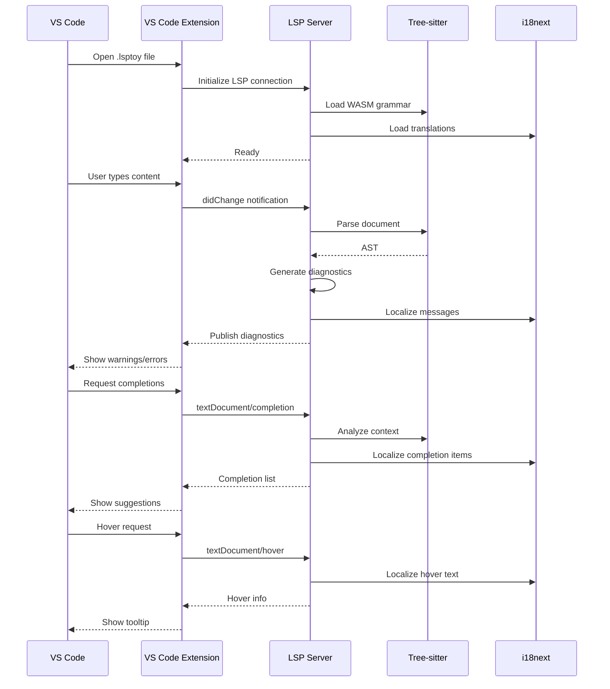

# lsp-toy

🚀 **Embedded Language Support** ✨ NEW  
Rich IDE features inside Markdown code fences! Get completions, hover info, and diagnostics for TypeScript, Python, Rust, Go, and more—all within your Markdown documents. [Learn more →](docs/features/EMBEDDED_README.md)VS Code LSP server that helps you author resume-style Markdown documents inside `.lsptoy` files.

LSP Toy VSCode extension

[](https://www.youtube.com/watch?v=mYs2Gx-8-Ok) 2:45


## ✨ Features

� **Embedded Language Support** ✨ NEW  
Rich IDE features inside Markdown code fences! Get completions, hover info, and diagnostics for TypeScript, Python, Rust, Go, and more—all within your Markdown documents. [Learn more →](EMBEDDED_README.md)

�🔍 **Diagnostics**  
Warns on `TODO` comments and relative links that do not resolve on disk. Highlights `TODO` lines and `[Project](./missing.md)` as warnings.

⚡ **Code Actions**  
Offers focused quick fixes for diagnostics. "Mark TODO as done" or "Remove broken link".

💡 **Completions**  
Suggests resume sections and Markdown formatting as you type. Trigger with `#` or `[` for headings, links, and formatting snippets.

📖 **Hover**  
Displays helpful tooltips for well-known technologies and links. Hover `Rust` to see a short description.

✏️ **Signature Help**  
Guides pseudo calls such as `contact("Jane", "Doe")`. Shows parameter names and descriptions while typing.

🎨 **Semantic Tokens**  
Adds semantic coloring for headings, emphasis, links, code spans, and TODOs. Headings/bold/links receive dedicated token types.

🌳 **Tree-sitter AST**  
Uses the `tree-sitter-markdown` grammar (via WASM) for parsing instead of regex heuristics. Diagnostics and tokens stay in sync with the Markdown structure.

🌍 **Locale Support**  
Respects client locale preferences for internationalized messages. Diagnostic messages appear in Spanish, French, etc. based on VS Code's language.

## 🔄 LSP Architecture



### 🔌 Embedded Language Architecture

```
┌─────────────────────────────────────────────────────┐
│          lsp-toy Host Server (Markdown)             │
├─────────────────────────────────────────────────────┤
│                                                     │
│  ┌─────────────────────────────────────────────┐   │
│  │      EmbeddedLanguageManager                │   │
│  │  • Tree-sitter fence detection              │   │
│  │  • Position projection                      │   │
│  │  • Request forwarding                       │   │
│  └─────────────────────────────────────────────┘   │
│           ↓              ↓              ↓           │
│  ┌──────────────┐ ┌────────────┐ ┌──────────────┐ │
│  │ TypeScript   │ │   Python   │ │    Rust      │ │
│  │   Server     │ │   Server   │ │   Server     │ │
│  └──────────────┘ └────────────┘ └──────────────┘ │
└─────────────────────────────────────────────────────┘
```

Inside Markdown code fences, lsp-toy automatically:
1. Detects the language from fence metadata (```typescript)
2. Spawns the appropriate language server (lazy, reused)
3. Forwards completion/hover requests to embedded server
4. Remaps ranges back to host document coordinates

**[→ Learn more about embedded languages](EMBEDDED_README.md)**

## 🚀 Getting started

```bash
npm install
npm run fetch:wasm   # Download prebuilt WASM files
npm run compile
```

### Running Modes

lsp-toy supports multiple deployment modes:

#### 1. Desktop Mode (Default - stdio)
Standard VS Code extension using stdio transport:
```bash
npm run compile
# Extension automatically starts when opening .lsptoy files
```

#### 2. WebSocket Mode (Browser Support)
For browser-based VS Code (vscode.dev, github.dev):
```bash
npm run compile
npm run start:ws-server  # Starts WebSocket server on port 8080
```

Configure the WebSocket URL in VS Code settings:
```json
{
  "lsptoy.websocketUrl": "ws://localhost:8080"
}
```

> **💡 HTTP Information Page**: If you access the WebSocket port via HTTP (e.g., `http://localhost:8080` in a browser), you'll see a helpful information page with setup instructions and a link to this repository. This is useful for debugging and verifying the server is running.
> 


### WASM Grammar Files

The language server uses `tree-sitter-markdown` compiled to WebAssembly for cross-platform parsing. **Prebuilt WASM files are included**, so you don't need to compile anything!

#### Quick Setup (Recommended)

Download the latest prebuilt WASM files:
```bash
npm run fetch:wasm
# or update to latest version
npm run update:wasm
```

The script automatically:
- ✓ Downloads both WASM files from GitHub releases
- ✓ Verifies they're valid WebAssembly modules
- ✓ Updates version information in documentation
- ✓ Skips download if files are already current

#### Advanced: Building WASM Yourself

If you need to build from source (usually unnecessary):

```bash
npm run build:wasm
```

Requirements:
- Emscripten: `brew install emscripten` (macOS) or https://emscripten.org/docs/getting_started/downloads.html
- Or Docker (automatically detected by build script)

**Note**: The original `ikatyang/tree-sitter-markdown` grammar cannot compile to WASM. This project uses prebuilt files from `tree-sitter-grammars/tree-sitter-markdown` which is WASM-compatible. See `GRAMMAR_NOTES.md` for details.

## 📦 Language Support

🚀 **TypeScript works out-of-the-box!** LSP-Toy includes a bundled TypeScript server with full completion and hover support.

### Optional Additional Languages
```bash
# Install language servers for more languages
npm install -g pyright                         # Python
npm install -g bash-language-server            # Shell
npm install -g vscode-json-languageserver      # JSON
npm install -g yaml-language-server            # YAML

# Language toolchains
cargo install rust-analyzer                    # Rust
go install golang.org/x/tools/gopls@latest    # Go
```

**[→ Full language support guide](scripts/README.md)**

## ✨ Features

| Capability | Description | Example Behavior |
| --- | --- | --- |
| Diagnostics | Warns on `TODO` comments and relative links that do not resolve on disk. | Highlights `TODO` lines and `[Project](./missing.md)` as warnings. |
| Code Actions | Offers focused quick fixes for diagnostics. | “Mark TODO as done” or “Remove broken link”. |
| Completions | Suggests resume sections and Markdown formatting as you type. | Trigger with `#` or `[` for headings, links, and formatting snippets. |
| Hover | Displays helpful tooltips for well-known technologies and links. | Hover `Rust` to see a short description. |
| Signature Help | Guides pseudo calls such as `contact("Jane", "Doe")`. | Shows parameter names and descriptions while typing. |
| Semantic Tokens | Adds semantic coloring for headings, emphasis, links, code spans, and TODOs. | Headings/bold/links receive dedicated token types. |
| Tree-sitter AST | Uses the `tree-sitter-markdown` grammar for parsing instead of regex heuristics. | Diagnostics and tokens stay in sync with the Markdown structure. |

## 🚀 Getting started

```bash
npm install
npm run compile
```

> **Note**
> The language server depends on Tree-sitter’s native bindings. If `npm install` fails with a C++ compiler error, rerun the command with `CXXFLAGS="-std=c++20" npm install` to enable C++20 support during the build.

If you see a `NODE_MODULE_VERSION` mismatch when launching the extension (for example when using <kbd>F5</kbd>), rebuild the native bindings against the Node runtime bundled with VS Code:

```bash
npm run rebuild:tree-sitter
```

The script will try to detect your VS Code CLI (`code`) automatically. If that is not on your PATH, set `VSCODE_EXECUTABLE_PATH` or `LSP_TOY_NODE_TARGET` before running the command to point at the correct runtime.

### Running the server directly

Compile first, then start the language server over stdio (default) or bind it to a TCP port:

```bash
node server/out/server.js            # stdio mode
LSP_PORT=2087 node server/out/server.js  # TCP socket on port 2087
# or node server/out/server.js --port 2087
```

Open `samples/sample-resume.lsptoy`, press <kbd>F5</kbd> to launch the Extension Development Host, and explore diagnostics, completions, hovers, and semantic colors in action.

## 🧪 Sample document

Use `samples/sample-resume.lsptoy` as a playground. It intentionally includes a `TODO` and a broken relative link so you can try the quick fixes. Typing `#` or `[` will surface completion suggestions tailored for résumé authoring.

## 🔧 Development

- `npm run compile` – build both the client and the server once.
- `npm run watch` – rebuild on every change.
- `npm test` – run the command-line stdio smoke test with debug logging.
- `npm run test:quiet` – run tests without debug logging (clean output).
- `npm run fetch:wasm` – download the latest prebuilt WASM files.
- `npm run build:wasm` – build WASM from source (requires Emscripten or Docker).

The extension entry point lives in `client/src/extension.ts`. The language server logic is implemented in `server/src/server.ts`.

### 🐛 Debug Mode

The extension includes comprehensive debug logging for all LSP operations. Debug logging is **controlled by the `LSP_TOY_DEBUG` environment variable**.

**In VS Code (F5):** Choose between two launch configurations:
- **"Extension"** - Debug logging enabled (default)
- **"Extension (No Debug Logs)"** - Clean output, no debug logs

**In tests:**
```bash
npm test              # With debug logging
npm run test:quiet    # Without debug logging
```

**Manual control:**
```bash
export LSP_TOY_DEBUG=true   # Enable
export LSP_TOY_DEBUG=false  # Disable
```

When enabled, view detailed output in:
- **Client logs**: Debug Console (Cmd+Shift+Y / Ctrl+Shift+Y)
- **Server logs**: Output Panel → "LSP Toy Language Server" (Cmd+Shift+U / Ctrl+Shift+U)

You'll see detailed information for:
- ✓ Parser initialization and WASM loading
- ✓ Document parsing and validation
- ✓ Every LSP request (completions, hover, code actions, etc.)
- ✓ Diagnostic generation with counts and details
- ✓ Semantic token generation with statistics
- ✓ Parse tree caching and reuse

Example output:
```
[LSP-TOY SERVER] onCompletion called for: file:///path/to/file.lsptoy
[LSP-TOY SERVER]   Position: line 5, char 0
[LSP-TOY SERVER]   Trigger character: '#'
[LSP-TOY SERVER]   → Providing section header completions
[LSP-TOY SERVER]   ✓ Returning 4 completion items
```

See [`DEBUG.md`](./DEBUG.md) for complete debugging guide with all output examples.

## 🌍 Internationalization

The server uses **i18next** for comprehensive internationalization with JSON-based translations. It automatically detects VS Code's display language and localizes:

- 📋 **Diagnostic messages** (with plural support)
- 💡 **Completion items** (labels, details, documentation)
- 📖 **Hover text** (with parameter interpolation)

**Supported languages:**
- 🇺🇸 English (default)
- 🇪🇸 Spanish
- 🇫🇷 French
- 🇵🇱 Polish

**Add your language!** See [`TRANSLATION_GUIDE.md`](./TRANSLATION_GUIDE.md) for a complete guide to contributing translations.

Test with different locales:

```bash
LSP_LOCALE=es-ES npm test  # Spanish
LSP_LOCALE=fr-FR npm test  # French
```

See [`LOCALE_SUPPORT.md`](./LOCALE_SUPPORT.md) for technical implementation details.

## 🧪 Testing

The project includes automated tests for LSP functionality and localization:

```bash
npm test              # Run all tests
npm run test:stdio    # Basic stdio smoke test
npm run test:i18n     # i18n test suite (all languages)
npm run test:quiet    # Run tests without debug output
```

See [`test/README.md`](./test/README.md) for complete test documentation.

## � Documentation

For comprehensive documentation, see the [`docs/`](./docs/) folder:

- **[Documentation Hub](docs/README.md)** - Complete documentation index
- **[Architecture Guide](docs/ARCHITECTURE.md)** - System design and components
- **[Embedded Language Features](docs/features/EMBEDDED_PHASE1.md)** - Language server aggregation
- **[Tree Outline Visualization](docs/features/TREE_OUTLINE_FEATURE.md)** - Document debugging tools
- **[Development Guide](docs/development/PHASE1_COMPLETE.md)** - Implementation details
- **[Testing Checklist](docs/development/TESTING_CHECKLIST.md)** - Manual testing procedures
- **[Troubleshooting](docs/troubleshooting/)** - Common issues and solutions

## �📄 License

This project is released under the MIT License.
